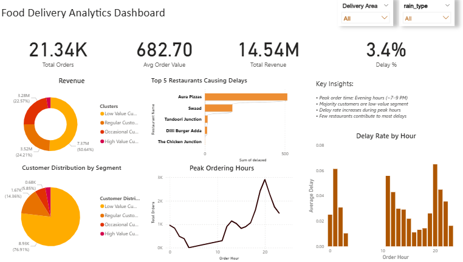
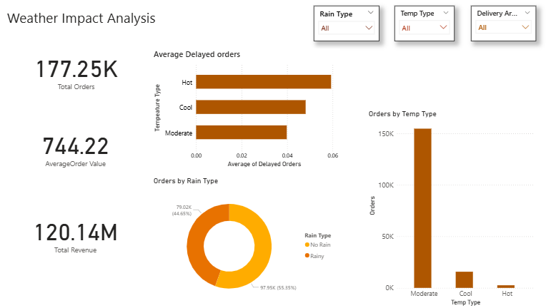

<h1 align="center">🐦‍🔥 Delivery Performance Analytics</h1>

  

  
  
  

---

## 📌 Overview

🧠 *“In data, every delay has a reason… and every pattern has a story.”*

This project analyzes food delivery operations using **Python, SQL, Excel, and Power BI** to uncover:

- ⏱️ Delivery inefficiencies  
- 👤 Customer behavior  
- 🚴 Rider performance  
- 🌧️ Weather impact  

---

## 🎯 Objectives

- 📉 Analyze delivery delays & peak-hour inefficiencies  
- 💰 Identify top revenue-driving customers  
- ⏱️ Evaluate rider waiting time impact  
- 📊 Build interactive dashboards  
- 🤖 Apply ML for delay pattern detection  

---

## 🧰 Tech Stack

  
  
  
  

---

## 📂 Dataset Description
* orders → order details, revenue, delivery time, rider performance & waiting time
* customers → customer behavior & segmentation
* weather → external factors affecting delivery

--- 

## 📁 Project Structure

├── Analysis/  
├── Data/      
├── Dashboard/                   
├── notebooks/                             
└── README.md

---

## 📊 Key Insights

> 💬 *“When you control time… you control the business.”*

- 📉 High delivery delays during peak hours
- 💰 Top 20% customers contribute majority revenue
- ⏱️ Rider waiting time significantly impacts delivery speed
- ⭐ Better-rated orders correlate with faster delivery
- 🌡️ Delivery delay increases with tempreature 
- 🌧️ Rain → delays ↑ revenue ↓
- 📉 Order volume drops during extreme weather

---

## ⚙️ Project Workflow

**1️⃣ Data Collection**  
Combined multiple datasets (orders, customers, weather) to simulate real-world delivery operations.

**2️⃣ Data Cleaning & Preprocessing**  
Handled missing values, standardized formats, and removed inconsistencies.                                                         
📁 [Data Preparation](notebooks/01_data_preparation.ipynb)

**3️⃣ Exploratory Data Analysis (EDA)**  
Identified demand patterns, peak hours, and revenue trends.  
📁 [Demand Analysis](notebooks/02_demand_analysis.ipynb)

**4️⃣ Operational Analysis**  
Analyzed prep time vs waiting time and calculated delay percentages.  
📁 [Operational Analysis](notebooks/03_operational_analysis.ipynb)

**5️⃣ Customer Analysis**  
Performed segmentation & Pareto analysis (Top 20% customers).  
📁 [Customer Analysis](notebooks/04_customer_analysis.ipynb)

**6️⃣ SQL Insights**  
Extracted KPIs, revenue trends, and customer frequency using SQL.  
📁 [SQL Analysis](notebooks/05_sql_bussiness_analysis.ipynb)

**7️⃣ Machine Learning**  
Built a model to detect delay patterns and key influencing factors.  
📁 [ML Analysis](notebooks/06_ML_analysis.ipynb)

**8️⃣ Weather Impact**  
Analyzed effect of weather on delivery time and order volume.  
📁 [Weather Analysis](notebooks/07_Weather_Data_Integration_for_BI.ipynb)

**9️⃣ Dashboard (Power BI)**  
Developed interactive dashboard with KPIs, filters, and insights.

📁 Folder :[Dashboard](dashboard/dashboard.pbix)

## 📈 Dashboard Preview

### 👨‍💻 Author
Pranay Shete
